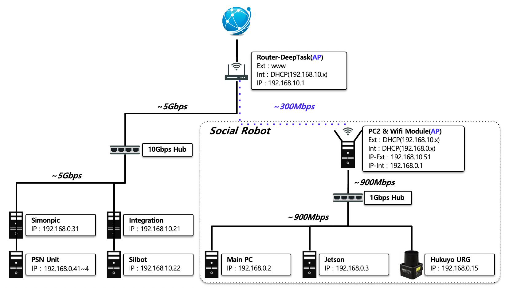

DeepTask Backup Disk Document
===========================================================

## SocialRobot

### PC1(Main)

로보케어 Base Package가 구동되는 PC [socialrobot_ros](https://github.com/deep-task/socialrobot_ros "깃허브")
실제 로봇 동작에 필요한 6가지 요소 관장
* LED(Ear-L,R,Base Wheel)
* Neck, Waist Joint
* Arm
* Speech
* Base Driving(Tele-Operating)
* ~~Navigation~~

Disk Label | 날짜 | OS |비고 | 동작 상태
------------ | ------------- | ------------- | ------------- | ------------- 
SocialRobot-PC1-1 | 2021.04.02 | Ubuntu Mate, 16.04 | 4차년도 통합 시나리오 동작 버전 | 
SocialRobot-PC1-2 | 2021.04.14 | Ubuntu Mate, 18.04 | 16.04->18.04 업그레이드 테스트 | 
SocialRobot-PC1-3 | 2021.04.28 | Ubuntu Mate, 16.04 | Moveit 설치 및 테스트 | 

### PC2

2세부 통합 프레임워크 구동 PC
* KIST-성격인식기
* HY-의도 추정기
* HY-발화 생성기
* DHCP Server
* ROS Multimaster
* ~~DeepTask GUI~~

Disk Label | 날짜 | OS |비고 | 동작 상태
------------ | ------------- | ------------- | ------------- | ------------- 
SocialRobot-PC2-1 | 2021.04.28 | Ubuntu, 16.04 | 4차년도 통합 시나리오 동작 버전 | 

### Jetson

ETRI 단기적 사회성 인식기

Disk Label | 날짜 | OS |비고 | 동작 상태
------------ | ------------- | ------------- | ------------- | ------------- 
SocialRobot-Jetson-1 | 2021.05.14 | Ubuntu(Nvidia kernel), 18.04 | 4차년도 통합 시나리오 동작 버전, microSD | 

## Integration Server Rack

2세부 통합 프레임워크 구동 PC(Only Interface)
* ~~KIST-성격인식기~~
* ~~HY-의도 추정기~~
* ~~HY-발화 생성기~~
* DHCP Server
* ROS Multimaster
* DeepTask GUI

### Integration PC

Disk Label | 날짜 | OS |비고 | 동작 상태
------------ | ------------- | ------------- | ------------- | ------------- 
Integration-1 | 2021.04.30 | Ubuntu, 16.04 | 4차년도 통합 시나리오 동작 버전 | 

### Simonpic

Disk Label | 날짜 | OS |비고 | 동작 상태
------------ | ------------- | ------------- | ------------- | ------------- 
Simonpic1-1 | 2021.04.28 | Ubuntu, 16.04 | 4차년도 통합 시나리오 동작 버전 | 
Simonpic2-1 | 2021.04.28 | Ubuntu, 16.04 | 4차년도 통합 시나리오 동작 버전 | 
PSN1-1 | 2021.05.14 | Ubuntu, 16.04 | 4차년도 통합 시나리오 동작 버전 | 
PSN2-1 | 2021.05.14 | Ubuntu, 16.04 | 4차년도 통합 시나리오 동작 버전 | 
PSN3-1 | 2021.05.14 | Ubuntu, 16.04 | 4차년도 통합 시나리오 동작 버전 | 
PSN4-1 | 2021.05.14 | Ubuntu, 16.04 | 4차년도 통합 시나리오 동작 버전 | 

