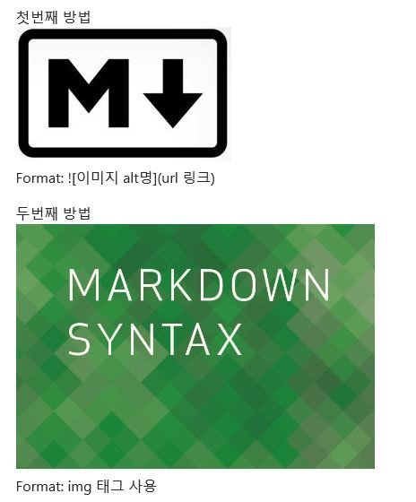

DeepTask Backup Disk Document
===========================================================


## SocialRobot

  
  

### PC1(Main)
로보케어 Base Package가 구동되는 PC [socialrobot_ros](https://github.com/deep-task/socialrobot_ros "깃허브")
실제 로봇 동작에 필요한 6가지 요소 관장
* LED(Ear-L,R,Base Wheel)
* Neck, Waist Joint
* Arm
* Speech
* Base Driving(Tele-Operating)
* ~~Navigation~~

Disk Label | 날짜 | OS |비고 | 동작 상태
------------ | ------------- | ------------- | ------------- | ------------- 
SocialRobot-PC1-1 | 2021.04.02 | Ubuntu Mate, 16.04 | 4차년도 통합 시나리오 동작 버전 | 
SocialRobot-PC1-2 | 2021.04.14 | Ubuntu Mate, 18.04 | 16.04->18.04 업그레이드 테스트 | 
SocialRobot-PC1-3 | 2021.04.28 | Ubuntu Mate, 16.04 | Moveit 설치 및 테스트 | 

### PC2
2세부 통합 프레임워크 설치 PC
DHCP Server, ROS Multimaster, 성격인식기, 


Disk Label | 날짜 | OS |비고 | 동작 상태
------------ | ------------- | ------------- | ------------- | ------------- 
SocialRobot-PC2-1 | 2021.04.28 | Ubuntu, 16.04 | 4차년도 통합 시나리오 동작 버전 | 


### Jetson

Disk Label | 날짜 | OS |비고 | 동작 상태
------------ | ------------- | ------------- | ------------- | ------------- 
SocialRobot-Jetson-1 | 2021.05.14 | Ubuntu(Nvidia kernel), 18.04 | 4차년도 통합 시나리오 동작 버전, microSD | 


## Integration Server
  

### Integration PC
Disk Label | 날짜 | OS |비고 | 동작 상태
------------ | ------------- | ------------- | ------------- | ------------- 
Integration-1 | 2021.04.30 | Ubuntu, 16.04 | 4차년도 통합 시나리오 동작 버전 | 


### Simonpic

Disk Label | 날짜 | OS |비고 | 동작 상태
------------ | ------------- | ------------- | ------------- | ------------- 
Simonpic1-1 | 2021.04.28 | Ubuntu, 16.04 | 4차년도 통합 시나리오 동작 버전 | 
Simonpic2-1 | 2021.04.28 | Ubuntu, 16.04 | 4차년도 통합 시나리오 동작 버전 | 
PSN1-1 | 2021.05.14 | Ubuntu, 16.04 | 4차년도 통합 시나리오 동작 버전 | 
PSN2-1 | 2021.05.14 | Ubuntu, 16.04 | 4차년도 통합 시나리오 동작 버전 | 
PSN3-1 | 2021.05.14 | Ubuntu, 16.04 | 4차년도 통합 시나리오 동작 버전 | 
PSN4-1 | 2021.05.14 | Ubuntu, 16.04 | 4차년도 통합 시나리오 동작 버전 | 


```bash
sudo pip3 install -r requiremets.txt
```


## 3. Usage
Use upper 3.x python version
```bash
./src/main.py
```
or
```bash
python3 src/main.py
```
d


## 4. Markdown Syntax


### 4-1. 헤더(Header)


# 헤더 크기 (h1) 
## 헤더 크기 (h2) 
### 헤더 크기 (h3) 
#### 헤더 크기 (h4) 
##### 헤더 크기 (h5) 
###### 해더 크기 (h6)


### 4-2. 목록(List)


Unordered 
* Item 1 
* Item 2 
    * Item 2a 
    * Item 2b 

Ordered 
1. Item 1 
1. Item 2 
1. Item 3 
    1. Item 3a 
    1. Item 3b

### 4-3. 이미지(Images)


첫번째 방법  
  
Format:   


두번째 방법  
<a href="#"></a>  
Format: img 태그 사용 - 이미지경로는 상대경로 or 절대경로  

### 4-4. 하이퍼링크(HyperLink)


[GitHub](http://github.com "깃허브")

### 4-5. 코드 블록(Code Blocks)


```javascript 
function test() { 
 console.log("hello world!"); 
} 
```

코드 스타일은 링크 참조 [GitHub](http://haroopress.com/post/fenced-code-block/, "코드 블럭 스타일")


### 4-6. 인용 상자(Blockquotes)


As Grace Hopper said: 

> I’ve always been more interested. 
> in the future than in the past.


### 4-7. 강조(Emphasis)


*This text will be italic* 
_This will also be italic_ 

**This text will be bold** 
__This will also be bold__ 

*You **can** combine them*


### 4-8. 테이블(Tables)


First Header | Second Header 
------------ | ------------- 
Content cell 1 | Content cell 2 
Content column 1 | Content column 2

### 4-9. 체크박스(Check Boxs)


- [x] this is a complete item 
- [ ] this is an incomplete item 
- [x] @mentions, #refs, [links](), **formatting**, and <del>tags</del> supported 
- [x] list syntax required (any unordered or ordered list supported)


### 4-10. 인라인 코드(Inline Code)


문단 중간에 `Code`를 넣을 수 있습니다. 
예를 들어 `printf("hello world!");` 이런 식으로 들어갑니다.

### 4-11. 수평선(Horizontal Line)


--- 
*** 
___

### 4-12. 탈출 문자(Backslash Escapes)


＼*literal asterisks＼* 
*literal asterisks* 
__＼*＼*Text＼*＼*__ 
_＼_Tom＼__


### 4-13. Github 이모지(EMOJI)


GitHub supports emoji! 
:+1: :sparkles: :camel: :tada: 
:rocket: :metal: :octocat:

### 4-14. 뱃지(Badge)


작성 예시 
<https://img.shields.io/badge/license-mit-green.svg"> 
https://img.shields.io/badge/--.svg 

APM: /apm/l/:packageName.svg 
AUR license: /aur/license/:packageName.svg
